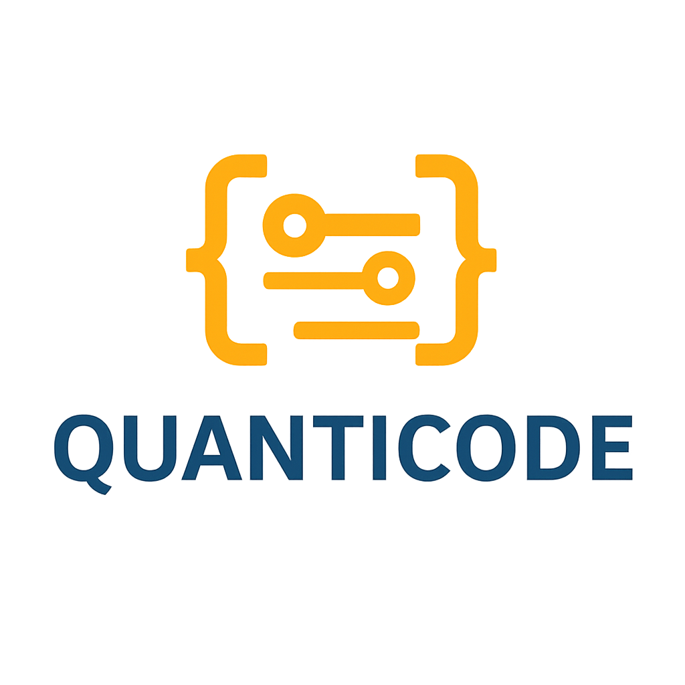

#   

 * Pour ce projet j'ai décidé de créer un site web responsive sur une entreprise nommée *Quanticode* créer à partir de ChatGPT. 
   Le site web mettra en avant les spécialités de l'entreprise ainsi qu'un accès à une Plateforme d'e-learning.

   > **Quanticode** est une entreprise spécialisée dans le **développement web** et **la formation professionnelle**. Nous accompagnons les entreprises
   > dans la création de sites performants et sur mesure, tout en formant des talents aux métiers du numérique : **SEO**, **DevOps**, **UX/UI Design**
   > et **développement web**.
   > Notre mission : allier innovation, pédagogie et expertise pour propulser les projets et les carrières digitales.

  ##  Installations 

  ###  Composants 

